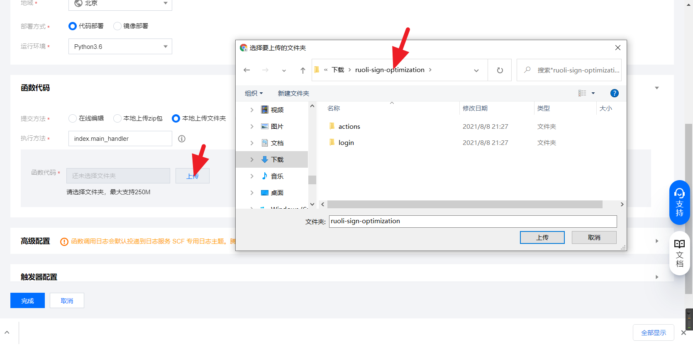
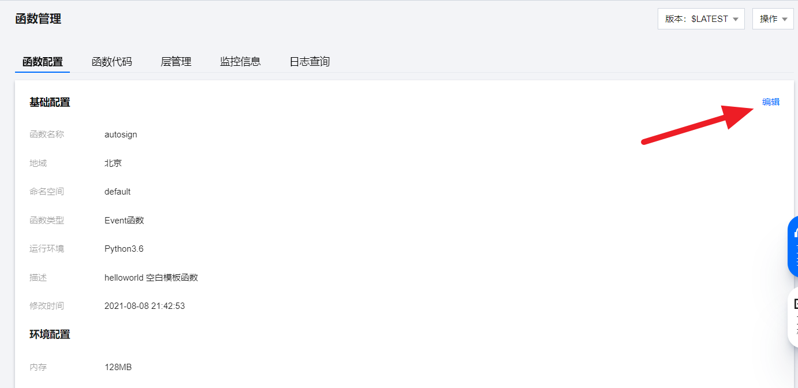
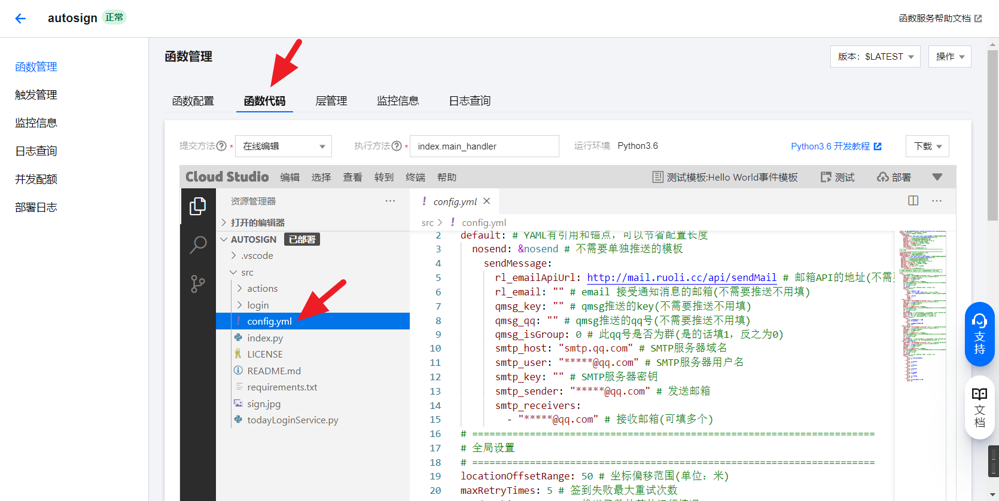
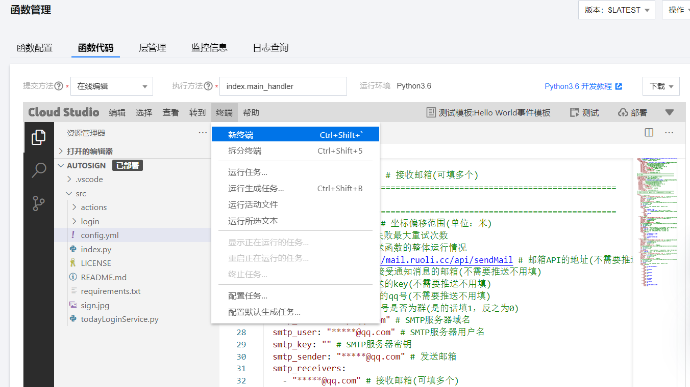
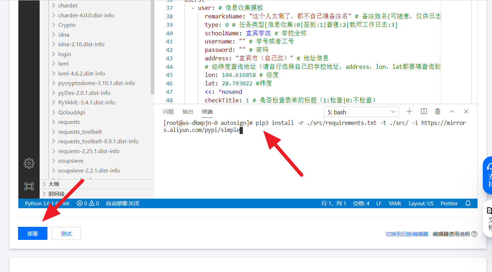

你被骗了，这只是一个**文言文学习仓库**。

# 滕王阁序

　　豫章故郡，洪都新府。星分翼轸，地接衡庐。襟三江而带五湖，控蛮荆而引瓯越。物华天宝，龙光射牛斗之墟；人杰地灵，徐孺下陈蕃之榻。雄州雾列，俊采星驰。台隍枕夷夏之交，宾主尽东南之美。都督阎公之雅望，棨戟遥临；宇文新州之懿范，襜帷暂驻。十旬休假，胜友如云；千里逢迎，高朋满座。腾蛟起凤，孟学士之词宗；紫电青霜，王将军之武库。家君作宰，路出名区；童子何知，躬逢胜饯。(豫章故郡 一作：南昌故郡；青霜 一作：清霜)

　　时维九月，序属三秋。潦水尽而寒潭清，烟光凝而暮山紫。俨骖騑于上路，访风景于崇阿。临帝子之长洲，得天人之旧馆。层峦耸翠，上出重霄；飞阁流丹，下临无地。鹤汀凫渚，穷岛屿之萦回；桂殿兰宫，即冈峦之体势。（层峦 一作：层台；即冈 一作：列冈；飞阁流丹 一作：飞阁翔丹）

　　披绣闼，俯雕甍，山原旷其盈视，川泽纡其骇瞩。闾阎扑地，钟鸣鼎食之家；舸舰弥津，青雀黄龙之舳。云销雨霁，彩彻区明。落霞与孤鹜齐飞，秋水共长天一色。渔舟唱晚，响穷彭蠡之滨，雁阵惊寒，声断衡阳之浦。(轴 通：舳；迷津 一作：弥津；云销雨霁，彩彻区明 一作：虹销雨霁，彩彻云衢)

　　遥襟甫畅，逸兴遄飞。爽籁发而清风生，纤歌凝而白云遏。睢园绿竹，气凌彭泽之樽；邺水朱华，光照临川之笔。四美具，二难并。穷睇眄于中天，极娱游于暇日。天高地迥，觉宇宙之无穷；兴尽悲来，识盈虚之有数。望长安于日下，目吴会于云间。地势极而南溟深，天柱高而北辰远。关山难越，谁悲失路之人；萍水相逢，尽是他乡之客。怀帝阍而不见，奉宣室以何年？(遥襟甫畅 一作：遥吟俯畅)

　　嗟乎！时运不齐，命途多舛。冯唐易老，李广难封。屈贾谊于长沙，非无圣主；窜梁鸿于海曲，岂乏明时？所赖君子见机，达人知命。老当益壮，宁移白首之心？穷且益坚，不坠青云之志。酌贪泉而觉爽，处涸辙以犹欢。北海虽赊，扶摇可接；东隅已逝，桑榆非晚。孟尝高洁，空余报国之情；阮籍猖狂，岂效穷途之哭！(见机 一作：安贫；以犹欢 一作：而相欢)

　　勃，三尺微命，一介书生。无路请缨，等终军之弱冠；有怀投笔，慕宗悫之长风。舍簪笏于百龄，奉晨昏于万里。非谢家之宝树，接孟氏之芳邻。他日趋庭，叨陪鲤对；今兹捧袂，喜托龙门。杨意不逢，抚凌云而自惜；钟期既遇，奏流水以何惭？

　　呜呼！胜地不常，盛筵难再；兰亭已矣，梓泽丘墟。临别赠言，幸承恩于伟饯；登高作赋，是所望于群公。敢竭鄙怀，恭疏短引；一言均赋，四韵俱成。请洒潘江，各倾陆海云尔：
　　滕王高阁临江渚，佩玉鸣鸾罢歌舞。
　　画栋朝飞南浦云，珠帘暮卷西山雨。
　　闲云潭影日悠悠，物换星移几度秋。
　　阁中帝子今何在？槛外长江空自流。

# 出师表

　　先帝创业未半而中道崩殂，今天下三分，益州疲弊，此诚危急存亡之秋也。然侍卫之臣不懈于内，忠志之士忘身于外者，盖追先帝之殊遇，欲报之于陛下也。诚宜开张圣听，以光先帝遗德，恢弘志士之气，不宜妄自菲薄，引喻失义，以塞忠谏之路也。

　　宫中府中，俱为一体；陟罚臧否，不宜异同。若有作奸犯科及为忠善者，宜付有司论其刑赏，以昭陛下平明之理，不宜偏私，使内外异法也。

　　侍中、侍郎郭攸之、费祎、董允等，此皆良实，志虑忠纯，是以先帝简拔以遗陛下。愚以为宫中之事，事无大小，悉以咨之，然后施行，必能裨补阙漏，有所广益。

　　将军向宠，性行淑均，晓畅军事，试用于昔日，先帝称之曰能，是以众议举宠为督。愚以为营中之事，悉以咨之，必能使行阵和睦，优劣得所。

　　亲贤臣，远小人，此先汉所以兴隆也；亲小人，远贤臣，此后汉所以倾颓也。先帝在时，每与臣论此事，未尝不叹息痛恨于桓、灵也。侍中、尚书、长史、参军，此悉贞良死节之臣，愿陛下亲之信之，则汉室之隆，可计日而待也。

　　臣本布衣，躬耕于南阳，苟全性命于乱世，不求闻达于诸侯。先帝不以臣卑鄙，猥自枉屈，三顾臣于草庐之中，咨臣以当世之事，由是感激，遂许先帝以驱驰。后值倾覆，受任于败军之际，奉命于危难之间，尔来二十有一年矣。

　　先帝知臣谨慎，故临崩寄臣以大事也。受命以来，夙夜忧叹，恐托付不效，以伤先帝之明；故五月渡泸，深入不毛。今南方已定，兵甲已足，当奖率三军，北定中原，庶竭驽钝，攘除奸凶，兴复汉室，还于旧都。此臣所以报先帝而忠陛下之职分也。至于斟酌损益，进尽忠言，则攸之、祎、允之任也。

　　愿陛下托臣以讨贼兴复之效，不效，则治臣之罪，以告先帝之灵。若无兴德之言，则责攸之、祎、允等之慢，以彰其咎；陛下亦宜自谋，以咨诹善道，察纳雅言，深追先帝遗诏。臣不胜受恩感激。今当远离，临表涕零，不知所言。

# 郑伯克段于鄢

　　初，郑武公娶于申，曰武姜。生庄公及共叔段。庄公寤生，惊姜氏，故名曰“寤生”，遂恶之。爱共叔段，欲立之，亟请于武公，公弗许。及庄公即位，为之请制。公曰：“制，岩邑也，虢叔死焉，佗邑唯命。”请京，使居之，谓之“京城大叔”。

　　祭仲曰：“都城过百雉，国之害也。先王之制：大都，不过参国之一；中，五之一；小，九之一。今京不度，非制也，君将不堪。”公曰：“姜氏欲之，焉辟害？”对曰：“姜氏何厌之有？不如早为之所，无使滋蔓。蔓难图也。蔓草犹不可除，况君之宠弟乎？”公曰：“多行不义，必自毙，子姑待之。”

　　既而大叔命西鄙北鄙贰于己。公子吕曰：“国不堪贰，君将若之何？欲与大叔，臣请事之；若弗与，则请除之，无生民心。”公曰：“无庸，将自及。”大叔又收贰以为己邑，至于廪延。子封曰：“可矣。厚将得众。”公曰：“不义不昵，厚将崩。”

　　大叔完聚，缮甲兵，具卒乘，将袭郑。夫人将启之。公闻其期，曰：“可矣！”命子封帅车二百乘以伐京。京叛大叔段。段入于鄢，公伐诸鄢。五月辛丑，大叔出奔共。

　　书曰：“郑伯克段于鄢。”段不弟，故不言弟；如二君，故曰克；称郑伯，讥失教也；谓之郑志。不言出奔，难之也。

　　遂置姜氏于城颍，而誓之曰：“不及黄泉，无相见也。”既而悔之。颍考叔为颍谷封人，闻之，有献于公。公赐之食。食舍肉。公问之，对曰：“小人有母，皆尝小人之食矣，未尝君之羹。请以遗之。”公曰：“尔有母遗，繄我独无！”颍考叔曰：“敢问何谓也？”公语之故，且告之悔。对曰：“君何患焉？若阙地及泉，隧而相见，其谁曰不然？”公从之。公入而赋：“大隧之中，其乐也融融！”姜出而赋：“大隧之外，其乐也洩洩！”遂为母子如初。

　　君子曰：“颍考叔，纯孝也。爱其母，施及庄公。《诗》曰：‘孝子不匮，永锡尔类。’其是之谓乎？”

# 桃花源记

　　晋太元中，武陵人捕鱼为业。缘溪行，忘路之远近。忽逢桃花林，夹岸数百步，中无杂树，芳草鲜美，落英缤纷。渔人甚异之，复前行，欲穷其林。

　　林尽水源，便得一山，山有小口，仿佛若有光。便舍船，从口入。初极狭，才通人。复行数十步，豁然开朗。土地平旷，屋舍俨然，有良田、美池、桑竹之属。阡陌交通，鸡犬相闻。其中往来种作，男女衣着，悉如外人。黄发垂髫，并怡然自乐。

　　见渔人，乃大惊，问所从来。具答之。便要还家，设酒杀鸡作食。村中闻有此人，咸来问讯。自云先世避秦时乱，率妻子邑人来此绝境，不复出焉，遂与外人间隔。问今是何世，乃不知有汉，无论魏晋。此人一一为具言所闻，皆叹惋。余人各复延至其家，皆出酒食。停数日，辞去。此中人语云：“不足为外人道也。”(间隔 一作：隔绝)

　　既出，得其船，便扶向路，处处志之。及郡下，诣太守，说如此。太守即遣人随其往，寻向所志，遂迷，不复得路。

　　南阳刘子骥，高尚士也，闻之，欣然规往。未果，寻病终。后遂无问津者。

# 琵琶行

元和十年，予左迁九江郡司马。明年秋，送客湓浦口，闻舟中夜弹琵琶者，听其音，铮铮然有京都声。问其人，本长安倡女，尝学琵琶于穆、曹二善才，年长色衰，委身为贾人妇。遂命酒，使快弹数曲。曲罢悯然，自叙少小时欢乐事，今漂沦憔悴，转徙于江湖间。予出官二年，恬然自安，感斯人言，是夕始觉有迁谪意。因为长句，歌以赠之，凡六百一十六言，命曰《琵琶行》。

浔阳江头夜送客，枫叶荻花秋瑟瑟。
主人下马客在船，举酒欲饮无管弦。
醉不成欢惨将别，别时茫茫江浸月。

忽闻水上琵琶声，主人忘归客不发。
寻声暗问弹者谁，琵琶声停欲语迟。
移船相近邀相见，添酒回灯重开宴。
千呼万唤始出来，犹抱琵琶半遮面。
转轴拨弦三两声，未成曲调先有情。
弦弦掩抑声声思，似诉平生不得志。
低眉信手续续弹，说尽心中无限事。
轻拢慢捻抹复挑，初为《霓裳》后《六幺》。(六幺 一作：绿腰)
大弦嘈嘈如急雨，小弦切切如私语。
嘈嘈切切错杂弹，大珠小珠落玉盘。
间关莺语花底滑，幽咽泉流冰下难。
冰泉冷涩弦凝绝，凝绝不通声暂歇。(暂歇 一作：渐歇)
别有幽愁暗恨生，此时无声胜有声。
银瓶乍破水浆迸，铁骑突出刀枪鸣。
曲终收拨当心画，四弦一声如裂帛。
东船西舫悄无言，唯见江心秋月白。

沉吟放拨插弦中，整顿衣裳起敛容。
自言本是京城女，家在虾蟆陵下住。
十三学得琵琶成，名属教坊第一部。
曲罢曾教善才服，妆成每被秋娘妒。(服 一作：伏)
五陵年少争缠头，一曲红绡不知数。
钿头银篦击节碎，血色罗裙翻酒污。(银篦 一作：云篦)
今年欢笑复明年，秋月春风等闲度。
弟走从军阿姨死，暮去朝来颜色故。
门前冷落鞍马稀，老大嫁作商人妇。
商人重利轻别离，前月浮梁买茶去。
去来江口守空船，绕船月明江水寒。
夜深忽梦少年事，梦啼妆泪红阑干。

我闻琵琶已叹息，又闻此语重唧唧。
同是天涯沦落人，相逢何必曾相识！
我从去年辞帝京，谪居卧病浔阳城。
浔阳地僻无音乐，终岁不闻丝竹声。
住近湓江地低湿，黄芦苦竹绕宅生。
其间旦暮闻何物？杜鹃啼血猿哀鸣。
春江花朝秋月夜，往往取酒还独倾。
岂无山歌与村笛，呕哑嘲哳难为听。
今夜闻君琵琶语，如听仙乐耳暂明。
莫辞更坐弹一曲，为君翻作《琵琶行》。

感我此言良久立，却坐促弦弦转急。
凄凄不似向前声，满座重闻皆掩泣。
座中泣下谁最多？江州司马青衫湿。

# 闻乐天授江州司马

残灯无焰影幢幢，此夕闻君谪九江。
垂死病中惊坐起，暗风吹雨入寒窗。

# 醉翁亭记

　　环滁皆山也。其西南诸峰，林壑尤美，望之蔚然而深秀者，琅琊也。山行六七里，渐闻水声潺潺，而泻出于两峰之间者，酿泉也。峰回路转，有亭翼然临于泉上者，醉翁亭也。作亭者谁？山之僧智仙也。名之者谁？太守自谓也。太守与客来饮于此，饮少辄醉，而年又最高，故自号曰醉翁也。醉翁之意不在酒，在乎山水之间也。山水之乐，得之心而寓之酒也。

　　若夫日出而林霏开，云归而岩穴暝，晦明变化者，山间之朝暮也。野芳发而幽香，佳木秀而繁阴，风霜高洁，水落而石出者，山间之四时也。朝而往，暮而归，四时之景不同，而乐亦无穷也。

　　至于负者歌于途，行者休于树，前者呼，后者应，伛偻提携，往来而不绝者，滁人游也。临溪而渔，溪深而鱼肥，酿泉为酒，泉香而酒洌，山肴野蔌，杂然而前陈者，太守宴也。宴酣之乐，非丝非竹，射者中，弈者胜，觥筹交错，起坐而喧哗者，众宾欢也。苍颜白发，颓然乎其间者，太守醉也。

　　已而夕阳在山，人影散乱，太守归而宾客从也。树林阴翳，鸣声上下，游人去而禽鸟乐也。然而禽鸟知山林之乐，而不知人之乐；人知从太守游而乐，而不知太守之乐其乐也。醉能同其乐，醒能述以文者，太守也。太守谓谁？庐陵欧阳修也。

# [ruoli-sign-optimization](https://github.com/IceTiki/ruoli-sign-optimization)

## 声明

基于[子墨仓库](https://github.com/ZimoLoveShuang/auto-submit)和[若离仓库](https://github.com/thriving123/fuckTodayStudy)修改的今日校园自动签到

> 备注: <u>配置文件不通用</u>

### 免责声明

本项目为Python学习交流的开源非营利项目，仅作为程序员之间相互学习交流之用。

严禁用于商业用途，禁止使用本项目进行任何盈利活动。

使用者请遵从相关政策。对一切非法使用所产生的后果，我们概不负责。

本项目对您如有困扰请联系我们删除。

### 对开发者

* 对若离仓库进行修改的部分(比如获取历史签到信息、政工签到等功能)，可以随意移植到自己的代码中，但<u>需要(MUST)在代码注释中标注来源</u>

### 对使用者

* 请不要惹人注目，比如

  * 进入签到排行榜前列

  * 乱填地址

  * 张扬、到处炫耀

    > 作为一个非计算机专业的学生，从接触项目下载python到上手修改脚本也就花了5天。
    >
    > 只是配置一个自动签到是很简单的事情，不要到处炫耀。

* 留意学校通知，看到譬如 "要求如实填写签到信息" 消息时，请将脚本里面填写的位置更新到你所在的真实地址

### 对代挂

* 考虑到服务器以及劳动成本，<u>允许收费代挂 或者 以免费代挂服务吸引流量</u>，但需要**满足以下所有条件**

  * 对单用户收费总额**不得超过5元**

  * 对服务对象**原样**转发以下文字

    > 根据自动签到项目所有者要求，将以下文字告知服务对象：
    >
    > 本服务基于 免费开源项目ruoli-sign-optimization
    >
    > 项目所有者有条件地允许收费代挂，但强调收费是被服务者对提供服务者(部署脚本时间的消耗、服务器资源消耗等)的补偿。

## 更新公告

* 2021-11-7更新，配置文件有修改(<u>请**删掉**配置中不需要用到的**可选项**</u>，不然会出现"今日校园版本过旧，请更新")
* 2021-12-16更新，pushplus使用方式更新，需要重新配置
* 2022-1-20更新，随今日校园更新
* 2022-1-20更新，pushplus支持[旧版](https://pushplus.hxtrip.com/index)和[新版](http://www.pushplus.plus/)。(兼容旧版配置文件)
* 2022-2-13更新，增强caslogin适配(同时也暂时删除了验证码识别)
* 2022-3-16更新，**配置文件有修改**，<u>信息收集多选题</u>以及<u>信息收集/签到/查寝图片选取规则</u>有变化
* 发现bug记得提交issue

## 概述

### 整体修改

- [x] 完善推送
- [x] 签到失败自动重试
- [x] 响应的json解析优化
- [x] 签到坐标随机偏移

------

- [x] 日志组件优化
- [x] 本地运行时保存执行日志

------

- [x] DeviceID通过用户名伪随机生成
- [x] 随机签到时间延迟
- [ ] UA伪随机生成
- [ ] 系统版本伪随机生成
- [ ] 手机型号伪随机生成

------

- [x] 图片上传支持本地图片
- [x] 图片上传支持在线图片(http\https)
- [ ] 支持本地文件形式存储的url地址集
- [ ] 支持在线存储的url地址集

### 签到修改

> 可以正常运作

- [x] 任务标题正则匹配
- [x] ismalposition参数本地判定
- [x] 支持签到已请假任务
- [x] 获取以往签到任务自动填写表单

### 信息收集修改

> 可以正常运作

- [x] 支持非必填项的填写，以及不填写必填项
- [x] 任务标题正则匹配
- [x] 支持图片类型收集(图片位置填在value中)
  (感谢[1216332750](https://github.com/1216332750)在issues中提供的代码参考)
- [x] 获取以往签到任务自动填写表单

### 查寝

> (极大概率)可以正常运作

- [x] 获取以往签到任务自动填写表单
- [x] 任务标题正则匹配

### 教师工作日志

> 年久失修，**不能用**了

### 政工签到

> (极大概率)可以正常运作

## 用户配置高级教程

配置文件遵从[yaml](https://www.runoob.com/w3cnote/yaml-intro.html)语法。

单用户配置大致长这样

```yaml
  - type: 
    schoolName: 
    username: ""
    password: ""
    checkTitle: 
    forms: 
      - form:
          title: 
          value: 
    lon:
    lat:
    address:
    photo: 
```

### 获取历史签到信息

目前**（仅签到任务/查寝/信息收集）**支持获取上次填报的表单、位置信息进行填报。（<u>会忽略配置问卷中已有的表单和位置信息</u>）

注意：<u>信息收集依然需要填写经纬度和地址，因为历史表单包含详细未知信息</u>

可以通过添加```getHistorySign```项启动这个功能。

```yaml
  - type: 
    schoolName: 
    username: ""
    password: ""
    getHistorySign: True # 获取历史表单功能启动
```

### 表单填报的时间格式

形如下的题目

> 9.最后核酸检测时间(日期时间)
> 题目规则:最早1900-01-01;最晚2099-12-31

其时间格式如下

```yaml
      - form:
          title: 
          value: "2001-01-01" # 一定要有引号(字符串)，否则会被识别为时间对象
```

如有其他时间格式，**按照表单中时间框中预览的格式填入**即可。

### 表单填报的地点格式

> <u>注意，这是表单的填报格式而非```address```项。</u>
>
> ```address```项按照[坐标查询](https://api.map.baidu.com/lbsapi/getpoint/)的地址填入即可(比如<u>北京市东城区天安门广场中央</u>)

地点的分隔符一般是```/```

```yaml
  - form:
      title: 
      value: "xx省/xxx/xxx/xxx" # 有些是xx/xx/xx
```

### 图片

查寝、政工签到都有```  photo```可填项。可以填入一个本地图片的位置（绝对/相对都可以）。

信息收集如果有图片收集，则可以作为问题答案填入```value```中。

#### 图片选取规则:

#### 图片地址可以是列表或者字符串

```yaml
    photo:
      - "图片文件夹"
      - "图片.jpg"
      - "图片2.jpg"
```

或者

```yaml
    photo: "图片.jpg"
```

或者

```yaml
    photo: "图片文件夹"
```

#### 图片地址也可以填写在线图片的地址

要**直接**点进去就能打开图片的那种，也就是所谓的直链，一般情况下是以文件拓展名（jpg,png,webp等）为结尾的
>错误的直链： https://699pic.com/tupian-400863814.html
正确的直链： https://tva4.sinaimg.cn/large/0072Vf1pgy1foxkioq4i5j31hc0u0e1o.jpg

>

**注意：目前requests仅支持http及https协议下的直链，如有ftp、sftp等协议的需求可提交pr进行支持（建议使用已有的依赖和标准库）**

可以如下填写多个网络地址

```yaml
    photo:
      - "http://sign.example.com/singphoto001.jpg"
      - "https://sign.example.com/singphoto002.png"
      - "https://sign.example.com/singphoto004.jpg"
```

也可以与本地地址混搭，程序会**优先**尝试在线地址，**全部失败**后会尝试使用本地地址。
```yaml
    photo:
      - "http://sign.example.com/singphoto001.jpg"
      - "https://sign.example.com/singphoto002.png"
      - "图片文件夹/图片.jpg"
      - "图片文件夹"
```


#### 地址中的时间占位符会被格式化([中文](https://www.runoob.com/python/python-date-time.html#%E6%A0%BC%E5%BC%8F%E5%8C%96%E6%97%B6%E9%97%B4)|[英文](https://docs.python.org/3/library/time.html#time.strftime)文档)

> 此方法可以指定每日上传的图片，从而避免上传重复的文件
**警告：因url中可能含有%，此功能可能导致url中正常字符被误格式化而无法正常使用，因此url中此项功能已被禁用**

```yaml
    photo:
      - "%y年%m月%d日的文件夹"
      - "%y年%m月%d日的图片.jpg"
```

会格式化为

```yaml
    photo:
      - "22年03月16日的文件夹"  
      - "22年03月16日的图片.jpg"
```

#### 如果是信息收集

则会将列表中的图片逐个上传(如果路径指向文件夹则从中随机选取一张图片)

#### 如果是签到/查寝/政工签到

则会在列表中随机选取一个路径进行上传(如果路径指向文件夹则从中随机选取一张图片)

### 代理

在用户配置中，配置```proxy```参数可以使用代理。

```yaml
  - type: 
    schoolName: 
    username: ""
    password: ""
    checkTitle: 
    forms: 
      - form:
          title: 
          value: 
    lon:
    lat:
    address:
    photo: 
    proxy: "http://host:port" # 注意缩进要和username、password等参数保持一致
```

代理请以```http://```或```https://```为开头。常见的形式有

* ```http://用户名:密码@123.123.123.123:1234```
* ```http://123.123.123.123:1234```

### 单独推送

用户配置中可以添加```sendMessage```推送仅该用户的签到情况，格式同整体推送（不需要的选项可以删掉）。

```yaml
  - type: 
    schoolName: 
    username: ""
    password: ""
    checkTitle: 
    forms: 
      - form:
          title: 
          value: 
    lon:
    lat:
    address:
    photo: 
    sendMessage:
      rl_emailApiUrl: http://mail.ruoli.cc/api/sendMail # 邮箱API的地址(不需要推送不用填)
      rl_email: "" # email 接受通知消息的邮箱(不需要推送不用填)
      qmsg_key: "" # qmsg推送的key(不需要推送不用填)
      qmsg_qq: "" # qmsg推送的qq号(不需要推送不用填)
      qmsg_isGroup: 0 # 此qq号是否为群(是的话填1，反之为0)
      pushplus_parameters: "" # pushplus参数，填入令牌(token)即可推送。也可以填入"token=xxx&topic=xxx"形式自定义更多参数
      pushplus_isNew: False # False使用旧版pushplus(https://pushplus.hxtrip.com)，True使用新版pushplus(http://www.pushplus.plus/)
      smtp_host: "smtp.qq.com" # SMTP服务器域名
      smtp_user: "*****@qq.com" # SMTP服务器用户名
      smtp_key: "" # SMTP服务器密钥
      smtp_sender: "*****@qq.com" # 发送邮箱
      smtp_receivers:
        - "*****@qq.com" # 接收邮箱(可填多个)
```

## 常见问题

* 如果在日志发现HTTP **418**(I'm a teapot.)，意为被CDN怀疑为爬虫脚本。**请尝试在配置中填入可用代理**。

## 使用方法

### 通用步骤

1. [下载代码包](https://github.com/IceTiki/ruoli-sign-optimization/archive/refs/heads/master.zip)

2. 准备python3环境([windows系统下python3安装教程](https://moe.best/baidu/?知乎%20windows系统怎么安装python3))

3. 安装第三方模块(依赖)

   1. 方法1——pip安装([教程](https://moe.best/baidu/?怎么用pip指令安装requirement.txt))

      > 一般先用```cd 地址```指令切换目录到代码文件夹
      >
      > 然后用```pip3 install -r requirements.txt -t ./ -i https://mirrors.aliyun.com/pypi/simple```安装第三方模块

   2. 方法2——手动将模块文件拖入代码文件夹

4. 安装[VScode](https://code.visualstudio.com/Download)，安装```yaml```和```python```相应的插件([教程](https://moe.best/baidu/?怎么安装vscode插件))

5. 用VScode打开```config.yml```，按照里面的注释填写配置

6. 运行```index.py```

7. 备注：如果签到不成功，问问题的时候请附带完整**日志**

### 腾讯云函数

#### 第一步

登录腾讯云，进入腾讯云函数https://console.cloud.tencent.com/scf/list

#### 第二步

选择一个**非广州的内陆节点**(比如上海、北京、成都)


#### 第三步

点击 **新建**


#### 第四步

选择自定义创建

选择本地上传文件夹

<u>备注：python3.7目前没有终端，请选择python3.6</u>


然后上传文件夹



#### 第五步

触发器选择 **自定义创建**

触发周期选择 **自定义触发周期**

Cron表达式填```15 0,8 * * *```(意思是每天0点和8点15分触发)

最后点 **完成**


#### 第六步

自动跳转到函数管理，进入函数配置

点击**编辑**

将**执行超时时间**设置为100秒

最后**保存**




#### 第七步

进入 **函数代码**

进入**config.yml**

将依照config.yml里的注释，**将自己的配置信息填入config.yml**



#### 第八步

点击 **终端-新终端**

在终端中**输入**```pip3 install -r ./src/requirements.txt -t ./src/ -i https://mirrors.aliyun.com/pypi/simple```

**按回车**，然后**等待执行完毕**

执行完毕后，点击**部署**，并**等待部署完毕**

**大 功 告 成**，第二天看看自动签到是否成功吧。(如果没成功，去询问别人为什么失败的时候一定要截图日志最后那一页)






