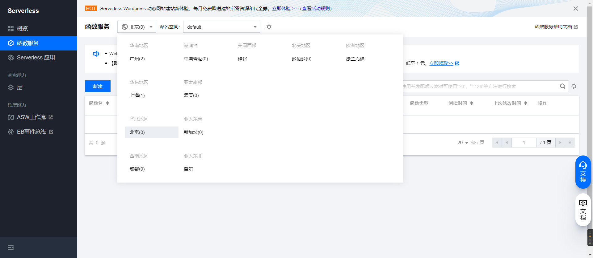
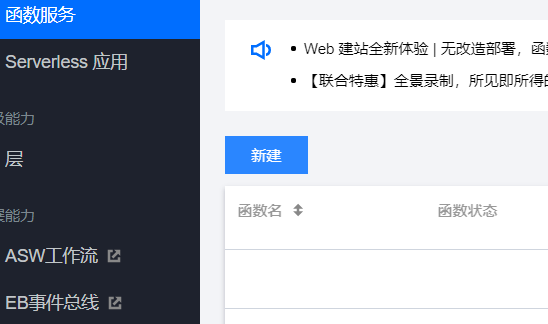
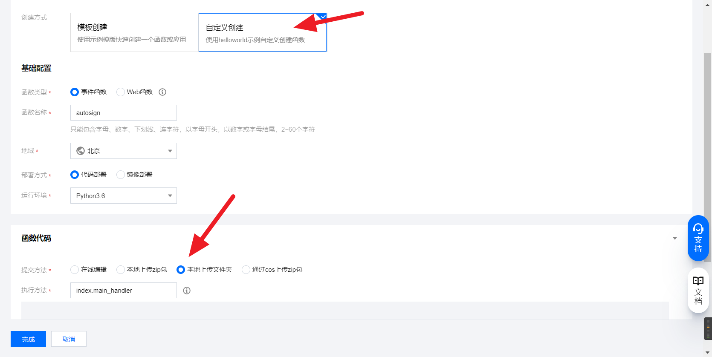
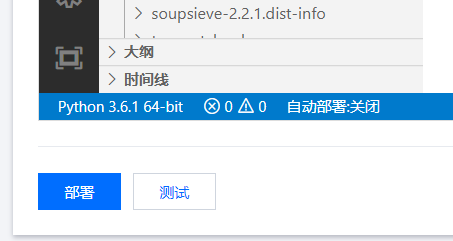

# 使用方法

## 注意事项

* 普通人只需要修改`config.yml`不需要修改其他代码文件
* 有一定编程能力的可以从`userDefined.py`开始尝试修改(配合 [开发者文档](开发者文档.md) 食用)。

## Windows

1. [下载代码包](https://github.com/IceTiki/ruoli-sign-optimization/archive/refs/heads/master.zip)

2. 准备python3环境([windows系统下python3安装教程](https://moe.best/baidu/?知乎%20windows系统怎么安装python3))

3. 安装第三方模块(依赖)

   1. 方法1——pip安装([教程](https://moe.best/baidu/?怎么用pip指令安装requirement.txt))

      > 一般先用```cd 地址```指令切换目录到代码文件夹
      >
      > 然后用```pip3 install -r requirements.txt -t ./ -i https://mirrors.aliyun.com/pypi/simple```安装第三方模块

   2. 方法2——手动将模块文件拖入代码文件夹

4. 安装[VScode](https://code.visualstudio.com/Download)，安装```yaml```和```python```相应的插件([教程](https://moe.best/baidu/?怎么安装vscode插件))

5. 用VScode打开```config.yml```，按照里面的注释填写配置

6. 运行```index.py```

7. 备注：如果签到不成功，问问题的时候请附带完整**日志**

## 虚拟环境

本项目支持使用 Poetry 及 Pdm 进行部署，在本地环境中安装好 Poetry 或 Pdm 后执行 `poetry install` 或 `pdm install` 创建并安装虚拟环境，使用 `poetry run python index.py` 或 `pdm run python index.py` 执行脚本。

值得注意的是，你需要确保环境变量正常生效的情况下才能使用上述命令，否则你应使用对应的可执行文件或解释器代替。例如 `cd /home/admin/ruoli-sign-optimization/ && /home/admin/.local/bin/poetry run python /home/admin/ruoli-sign-optimization/index.py` (仅作为演示使用，请勿直接使用!!!)

## 腾讯云函数

### 第一步

登录腾讯云，进入腾讯云函数https://console.cloud.tencent.com/scf/list

### 第二步

选择一个**非广州的内陆节点**(比如上海、北京、成都)



### 第三步

点击 **新建**



### 第四步

选择自定义创建

选择本地上传文件夹

<u>运行环境建议选择python3.7</u>



然后上传文件夹


### 第五步

触发器选择 **自定义创建**

触发周期选择 **自定义触发周期**

Cron表达式填```15 0,8 * * *```(意思是每天0点和8点15分触发)

最后点 **完成**


### 第六步

自动跳转到函数管理，进入函数配置

点击**编辑**

将**执行超时时间**设置为100秒

最后**保存**


### 第七步

进入 **函数代码**

进入**config.yml**

将依照config.yml里的注释，**将自己的配置信息填入config.yml**


### 第八步

点击 **终端-新终端**

在终端中**输入**```pip3 install -r ./src/requirements.txt -t ./src/ -i https://mirrors.aliyun.com/pypi/simple```

**按回车**，然后**等待执行完毕**

执行完毕后，点击**部署**，并**等待部署完毕**

**大 功 告 成**，第二天看看自动签到是否成功吧。(如果没成功，去询问别人为什么失败的时候一定要截图日志最后那一页)




