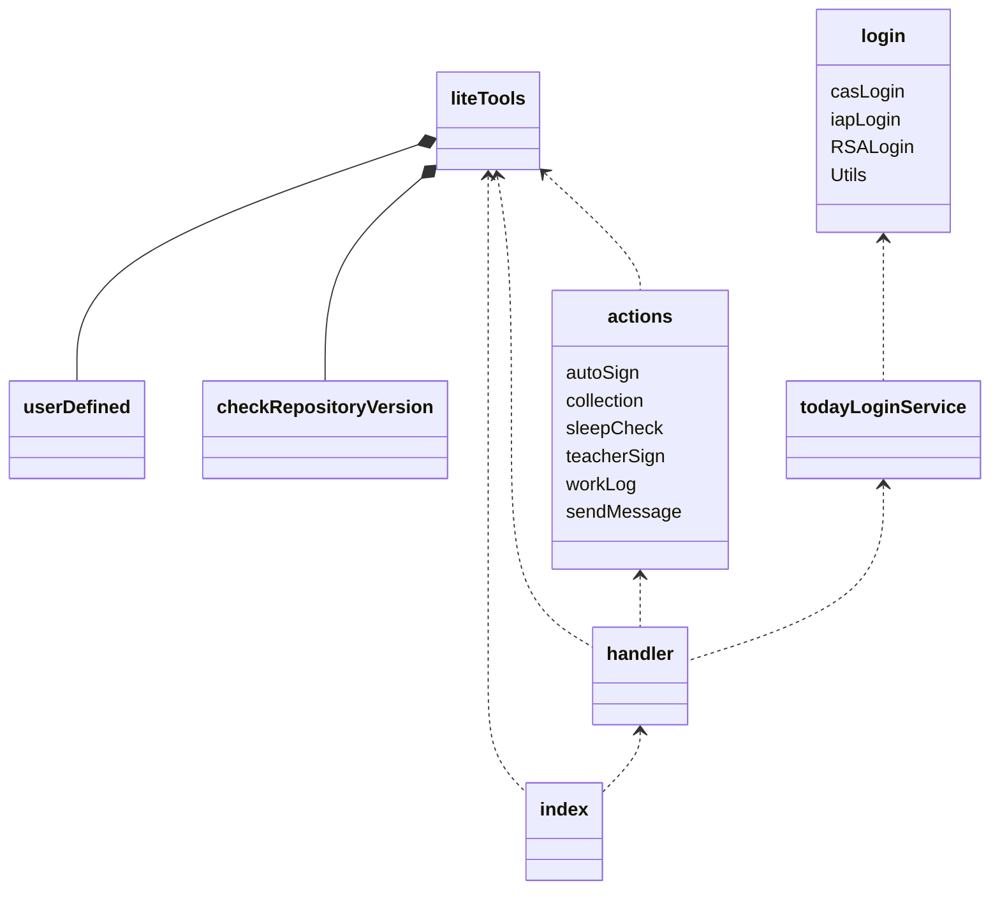

## 代码依赖关系



* 待改进
  * handler会传入一个handler的类进入actions, 让actions封装不彻底

## 用户自定义函数(测试功能)

用户可以在`userDefined.py`里面使用自定义函数。此文件内需要定义一个`index`函数

```python
def index(event, context):
    pass
```

这个函数会在以下四种情况被触发

### 单个用户任务执行前

此时传入的数据为

```python
event = {
    "msg": f"『{self.username}』个人任务即将执行",  # 触发消息
    "from": "task start"  # 触发位置
}
context = {
    "scriptVersion": LL.prefix,  # 脚本版本

    "username": self.username,  # 用户账号
    "remarkName": self.config["remarkName"],  # 用户备注名

    "attempts": self.attempts,  # 执行尝试次数
    "maxtry": self.maxTry,  # 最大尝试次数

    "msg": self.msg,  # 任务执行消息
    "statusCode": self.code,
    "statusCodehead": self.codeHead,
    "statusMsg": self.statusMsg[self.code],  # 状态信息(完整版)
    "statusMsgLite": self.statusMsg_lite[self.codeHead],  # 状态信息(短版)
}
```

> statusCode和statusCodehead是`int`类型的值，其含义可见下表
>
> ```python
> statusCodehead = {
>  0: '待命',
>  1: '完成',
>  2: '跳过',
>  3: '错误',
>  4: '缺失',
> }
> statusCode = {
>  0: "等待执行",
>  1: "出现错误(等待重试)",
>  100: "任务已被完成",
>  101: "该任务正常执行完成",
>  200: "用户设置不执行该任务",
>  201: "该任务不在执行时间",
>  300: "出错",
>  301: "当前情况无法完成该任务",
>  400: "没有找到需要执行的任务"
> }
> ```

### 单个用户任务执行后

此时传入的数据为

```python
event = {
    "msg": f"『{self.username}』个人任务执行完成",
    "from": "task end"
}
context = {
    "scriptVersion": LL.prefix,  # 脚本版本

    "username": self.username,  # 用户账号
    "remarkName": self.config["remarkName"],  # 用户备注名

    "attempts": self.attempts,  # 执行尝试次数
    "maxtry": self.maxTry,  # 最大尝试次数

    "msg": self.msg,  # 任务执行消息
    "statusCode": self.code,
    "statusCodehead": self.codeHead,
    "statusMsg": self.statusMsg[self.code],  # 状态信息(完整版)
    "statusMsgLite": self.statusMsg_lite[self.codeHead],  # 状态信息(短版)
}
```

> * 注意，无论执行是否成功都会触发自定义函数。可以通过`statusCodehead`判断执行是否成功

### 全局任务执行前

此时传入的数据为

```python
event = {
    "msg": f"任务序列即将执行",  # 触发消息
    "from": "global start"  # 触发位置
}
context = {
    "taskcount_all": sum(codecount),  # 全部任务数
    "taskcount_todo": codecount[0],  # 待命任务数
    "taskcount_done": codecount[1],  # 完成任务数
    "taskcount_skip": codecount[2],  # 跳过任务数
    "taskcount_error": codecount[3],  # 出错任务数
    "taskcount_notFound": codecount[4],  # 缺失任务数(没有找到相关任务)
    "taskcount_executed": sum(codecount) - codecount[2],  # 被执行任务数(没有被跳过的任务)

    "scriptVersion": LL.prefix,  # 脚本版本
    "runTime": TT.formatStartTime(),  # 脚本启动时间(%Y-%m-%d %H:%M:%S格式)
    "usedTime": TT.executionSeconds(),  # 运行消耗时间(浮点数, 单位:秒)

    "taskWebhook": [i.webhook for i in self.taskList],  # 一个列表, 包含所有任务的webhook参数
}
```

### 全局任务执行后

此时传入的数据为

```python
event = {
    "msg": f"任务序列执行完毕",  # 触发消息
    "from": "global end"  # 触发位置
}
context = {
    "taskcount_all": sum(codecount),  # 全部任务数
    "taskcount_todo": codecount[0],  # 待命任务数
    "taskcount_done": codecount[1],  # 完成任务数
    "taskcount_skip": codecount[2],  # 跳过任务数
    "taskcount_error": codecount[3],  # 出错任务数
    "taskcount_notFound": codecount[4],  # 缺失任务数(没有找到相关任务)
    "taskcount_executed": sum(codecount) - codecount[2],  # 被执行任务数(没有被跳过的任务)

    "scriptVersion": LL.prefix,  # 脚本版本
    "runTime": TT.formatStartTime(),  # 脚本启动时间(%Y-%m-%d %H:%M:%S格式)
    "usedTime": TT.executionSeconds(),  # 运行消耗时间(浮点数, 单位:秒)

    "taskWebhook": [i.webhook for i in self.taskList],  # 一个列表, 包含所有任务的webhook参数
}
```

