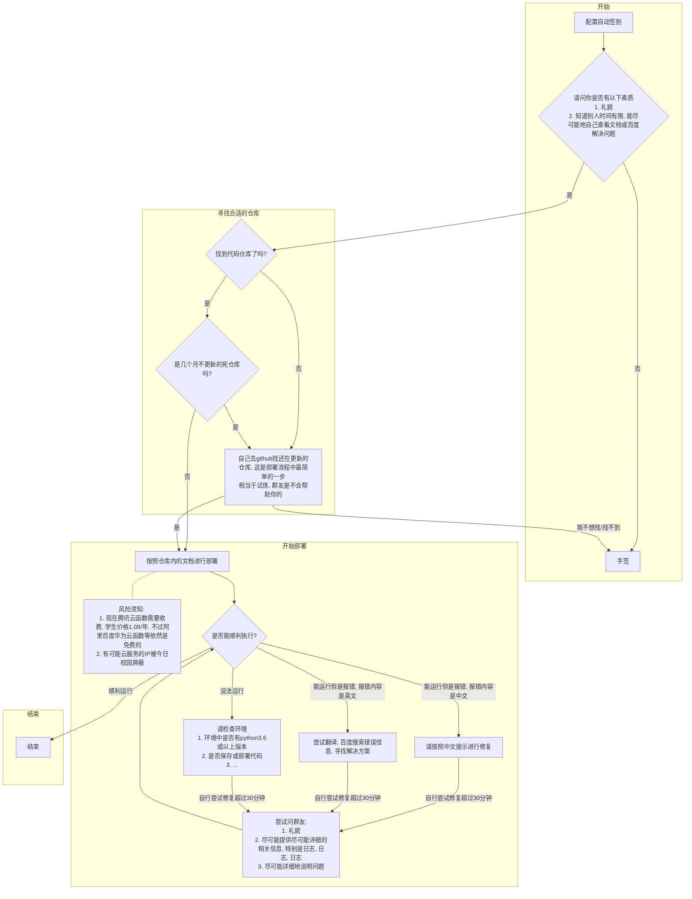

```mermaid
flowchart TD

subgraph 开始
Z[手签]
Z0[配置自动签到]
Z1{请问你是否有以下素质\n1. 礼貌\n2. 知道别人时间有限, 能尽可能地自己查看文档或百度解决问题}
end

subgraph 寻找合适的仓库
A1{找到代码仓库了吗?}
A2{是几个月不更新的死仓库吗?}
A3[自己去github找还在更新的仓库, 这是部署流程中最简单的一步\n相当于试炼, 群友是不会帮助你的]
end

subgraph 开始部署
B1[按照仓库内的文档进行部署]
B11[风险须知: \n1. 现在腾讯云函数需要收费, 学生价格1.08/年. 不过阿里百度华为云函数等依然是免费的\n2. 有可能云服务的IP被今日校园屏蔽]
B2{是否能顺利执行?}
B21[请按照中文提示进行修复]
B22[尝试翻译, 百度搜索错误信息, 寻找解决方案]
B23[请检查环境\n1. 环境中是否有python3.6或以上版本\n2. 是否保存或部署代码\n3. ...]
B2q[尝试问群友:\n1. 礼貌\n2. 尽可能提供尽可能详细的相关信息, 特别是日志, 日志, 日志\n3. 尽可能详细地说明问题]
end

subgraph 结束
C[结束]
end


Z0 --> Z1
Z1 --> |否|Z
Z1 --> |是|A1
A1 --> |是| A2
A1 --> |否| A3
A2 --> |是| A3
A2 --> |否| B1
A3 --> |是| B1
A3 --> |我不想找/找不到| Z
B1 -.- B11
B1 --> B2
B2 --> |能运行但是报错, 报错内容是中文|B21
B21 --> |自行尝试修复超过30分钟|B2q
B2 --> |能运行但是报错, 报错内容是英文|B22
B22 --> |自行尝试修复超过30分钟|B2q
B2 --> |没法运行|B23
B23 --> |自行尝试修复超过30分钟|B2q
B2q --> B2
B2 --> |顺利运行|C
```

